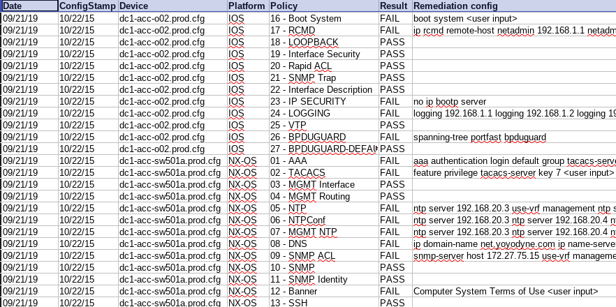

# config-compliance

## Installation #

    git clone git://github.com/kevinbowen777/config-compliance.git

## Description #

    A collection of perl scripts that checks local Cisco configuration files
	against user managed policy templates and produces a PASS/FAIL
	report based upon the defined policies. Here is part of a sample
	report:

## Usage #

Files:

    * cisco-compliance-reports.pl - Initiate generation of report(s),
	                  their output format, and destination.
	* check-cisco-configs.pl - Pulls device information from device list
			    	  Determine whether config is an IOS or NX-OX device
        		      and run the appropriate platform's policy script. 
	* create_device_list.sh - Creates lists based on device naming
	                  (prod, corp, dev, dc1, etc.)
	* ioslib.pm - Collection of device functions
	* policycheck_IOS_1.2.1.pl - Parses device.cfg against IOS templates
	* policycheck_NX-OS_1.2.1.pl - Parses device.cfg against NX-OS templates

## License

